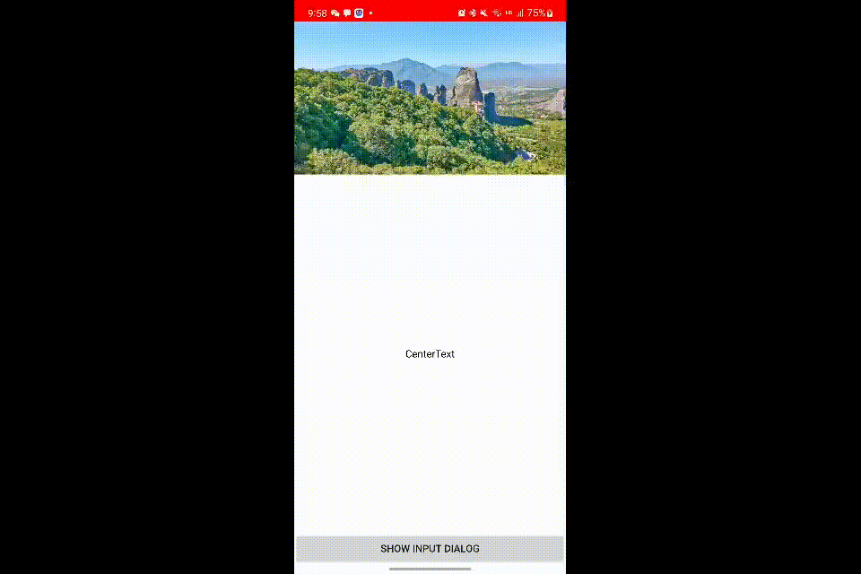
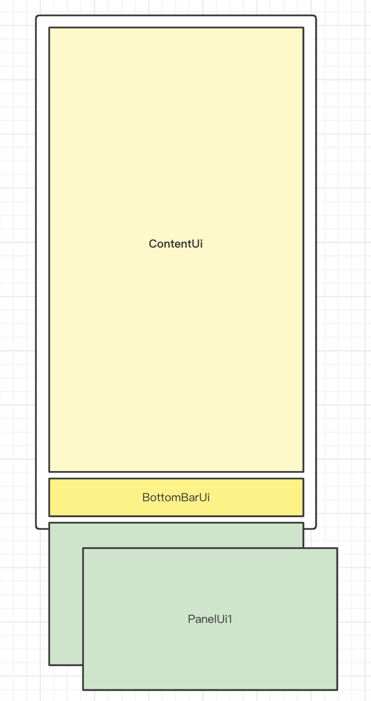

# AwareKeyboard  UiKit

AwareKeyboard UIKit 提供了在安卓开发中使用输入面板场景下的UI组件支持，通过简单的集成实现对软键盘输入面板的管理

  

## 功能

- 支持Android 5 - Android 12
- 提供Widget、Dialog场景下的基础UI组件
- 提供对软键盘状态、高度检测的监听器

## 集成

1. 在Android Studio工程的项目的 build.gradle 文件中添加 MavenCentral() 仓库

```kotlin
allprojects {
    repositories {
        mavenCentral()
    }
}
```

1. 在需要使用的子项目的 build.gradle 中添加依赖声明

```kotlin
dependencies {
    implementation("io.github.shinyshine90:keyboard-aware-layout:0.0.1")
}
```

## 使用方式

AwareKeyboard UIKit 提供了两类使用场景的实现：

1. 输入面板常驻于用户界面中，类似于Telegram、微信的聊天页的输入场景。
2. 输入面板不常驻于用户界面，类似于抖音直播、B站评论区的输入场景，输入组件不在Activity的Window中。

### 场景一：

通过继承`KeyboardAwareLayout` 声明用户界面，设计思路有点像声明式UI范式，简单使用如下，详细使用可参考Demo工程中的`ChatDemoActivity` 中`contentView`的实现方式。

```kotlin
class XxxLayout constructor(context: Context, attrs: AttributeSet?) :
 KeyboardAwareLayout(context, attrs) {
    
    override fun createContentUi(): View {
        return ContentUi(context)
    }

    override fun createKeyboardBottomUi(): KeyboardBottomUi {
        return KeyboardBottomUi(
            bottomBar = BottomBarUi(context),
            bottomPanelBackgroundColor = Color.WHITE,
            bottomPanelRegistrations = ArrayMap<Int, PanelUi>().apply {
                this[R.id.xxxx] = createExactlyHeightPanel(PanelUi1(context), 500)
                this[R.id.xxxx] = createAdjustKeyboardPanel(PanelUi2(context))
            }
        )
    }
    
}
```

下图展示KeyboardAwareLayout基本工作原理

KeyboardAwareLayout继承了LinearLayout 并指定了布局方向为垂直布局。

createContentUi()方法指定返回主内容区域，初始化时被添加至LinearLayout，高度指定为填充剩余空间；

createKeyboardBottomUi()方法指定了下面板区域，由BottomBarUi 及 一些列PanelUi构成，其中
bottomPanelRegistrations属性用来关联BottomBarUi中子元素点击事件同PanelUi的联动关系。



### 场景二:

详细使用可参考Demo工程中的`DemoKeyboardDialog`

```kotlin
class TestDialog(activity: Activity) : KeyboardDialog(activity) {
    
    override fun createKeyboardAwareLayout(context: Context): KeyboardAwareLayout {
        return object : KeyboardAwareLayout(context) {
            override fun createContentUi(): View {
                TODO("Not yet implemented")
            }

            override fun createKeyboardBottomUi(): KeyboardBottomUi {
                TODO("Not yet implemented")
            }

        }
    }
}
```